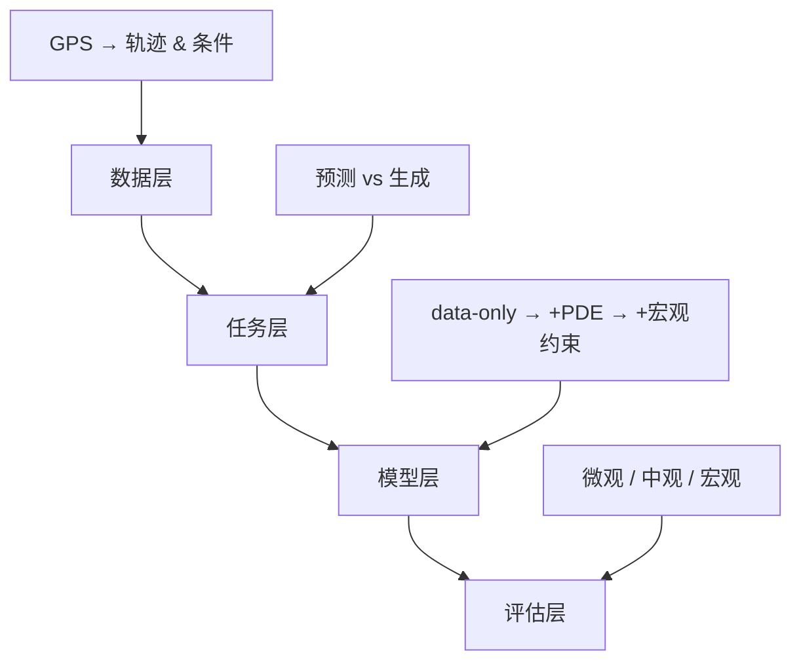
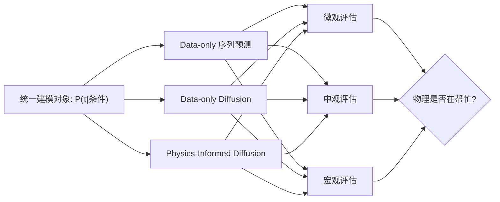

# 轨迹生成研究方法论：物理约束扩散模型

> **核心主线**：从真实车辆 GPS 轨迹出发，明确建模对象是"条件轨迹分布" $P(\tau \mid \text{条件})$，做三层对比：
> 1. 纯数据的序列预测 baseline
> 2. 纯数据的轨迹扩散生成
> 3. 加入统计物理 / PDE 先验的物理约束扩散生成
>
> 用**微观**（单条轨迹）、**中观**（OD / path）、**宏观**（标度律）三个层次验证"物理是否真的在帮忙"。

---

## 一、建模目标：条件轨迹分布

### 1.1 统一问题定义

给定：
- 出发点 $o$（或起始道路/区域 ID）
- 目的地 $d$（或终点区域）
- 出发时间 $t_0$
- 环境信息 env（道路网络、历史流量等）

模型要学习的是：**一条完整行程轨迹的条件分布**

$$P(\tau = (x_{1:T}) \mid o, d, t_0, \text{env})$$

### 1.2 方法论差异

| 方法类型 | 学习目标 | 输出形式 |
|---------|---------|---------|
| 传统 RNN / Transformer | $\arg\max_\tau P(\tau \mid \text{条件})$ | 最可能的一条路（或 top-k） |
| Diffusion 生成模型 | 整个 $P(\tau \mid \text{条件})$ | 可采样的轨迹集合分布 |
| + 物理约束 | $P(\tau \mid \text{条件})$ + 结构约束 | 满足物理规律的轨迹分布 |

> **物理 / PDE / 标度律**：不是多一个模块，而是一种**对分布的结构约束**——哪些轨迹合理、整体统计要长什么样。

### 1.3 研究框架四层结构



---

## 二、数据层：从 GPS 到模型输入

### 2.1 基本预处理流程


1. **地图匹配（Map-Matching）**
   - 将 GPS 点匹配到道路网络
   - 输出：道路 ID、沿线位置

2. **轨迹切分（Trip Segmentation）**
   - 按停车时间 / 连续行驶分 trip
   - 阈值建议：停车 > 5 分钟视为 trip 结束

3. **坐标统一**
   - 统一投影坐标（如 UTM）或栅格坐标
   - 便于与 PDE / nav_field 对齐

### 2.2 数据归一化 (Data Normalization)

> [!WARNING]
> **必须项**：未经归一化的坐标直接输入神经网络会导致训练失败。

| 特征 | 处理方式 | 目标范围 | 反归一化 |
|-----|---------|---------|---------|
| **位置** (pos) | Min-Max 到 $[-1, 1]$ 或 Z-Score | $[-1, 1]$ | 需要 |
| **速度** (vel) | Z-Score (减均值除标准差) | $\approx [-3, 3]$ | 需要 |
| **导航** (nav) | 简单缩放 (如 $\times 1.0$) | $[-1, 1]$ | 不需要 |

**实施位置**：`src/data/preprocess.py`，必须保证训练和推理使用同一套统计量。

### 2.2 条件变量定义

| 变量 | 符号 | 说明 | 必需 |
|-----|------|-----|-----|
| 起点 | $o$ | 起始道路/区域 ID 或坐标 | ✓ |
| 终点 | $d$ | 终止道路/区域 ID 或坐标 | ✓ |
| 出发时间 | $t_0$ | 小时 + weekday/weekend | ✓ |
| 交通状态 | env | 全局交通拥堵指数等 | 可选 |

### 2.3 序列表示格式

沿用现有 Phase 4 的 sliding window 形式：

```python
# 每条 trip 的时间序列
trajectory = {
    'pos': np.array([...]),      # 位置序列 (T, 2)
    'vel': np.array([...]),      # 速度序列 (T, 2)
    'nav': np.array([...]),      # 导航场方向 (T, 2)
}

# 训练样本格式
sample = {
    'obs': history[:H],          # 历史 H 步作为观测
    'cond': (o, d, t0, env),     # 条件变量
    'action': future[:F],        # 未来 F 步作为预测目标
}
```

---

## 三、任务层：三种能力对比

### 3.1 能力矩阵

> [!NOTE]
> **关键约定**：无论模型输出是速度还是位置，**评估时必须统一转换为位置序列**进行指标计算。

| 能力 | 描述 | 核心问题 |
|-----|------|---------|
| **A: 短期预测** | 给定历史，预测下一步/多步 | 误差随步数如何增长？ |
| **B: 轨迹生成** | 给定条件，采样完整轨迹 | 分布是否像真实数据？ |
| **C: 物理一致性** | 生成轨迹满足宏观统计规律 | 物理先验是否真的有用？ |

### 3.2 能力 A：短期预测

$$f_\theta: (\mathbf{o}, c) \mapsto \hat{x}_{t+1} \text{ 或 } x_{t+1:t+F}$$

- 标准的深度序列预测任务
- 用于建立 baseline 和量化数据难度

### 3.3 能力 B：条件轨迹生成

- 给定 $(o, d, t_0, \text{env})$，采样多条完整轨迹
- 强调分布拟合能力，而非单点预测精度

### 3.4 能力 C：物理一致性

- OD 分布、位移分布、标度律是否与真实一致
- 专门考察物理先验的有效性

---

## 四、模型层：三阶模型体系

### 4.1 第 1 阶：纯数据序列预测 Baseline

> **目的**：建立"data-only 能做到哪"的下界

#### 模型架构

```
输入: [历史观测 o, 条件 c(embedding)]
      ↓
[RNN / Transformer Encoder]
      ↓
输出: 下一位置 / 位置序列
```

#### 损失函数

- **连续坐标**：MSE Loss
- **离散化**：Cross-Entropy Loss（栅格/道路 ID）

#### 评估重点

- 一步预测：Top-k accuracy、距离误差
- 多步 rollout：误差累积曲线

### 4.2 第 2 阶：纯数据轨迹扩散（Data-only Diffusion）

> **目的**：对比生成模型在分布拟合上的优势

#### 模型设定

- **生成对象**：速度序列（与 Phase 4 一致）
- **网络结构**：1D-UNet + DDPM / DDIM
- **条件化**：
  - 局部历史 $\mathbf{o}$ → flatten 为 global condition
  - 全局条件 $c = (o, d, t_0, \text{env})$ → embedding

#### 训练目标

$$\mathcal{L}_\text{diff} = \mathbb{E}\left[ \|\epsilon - \epsilon_\theta(x_t, t, c)\|^2 \right]$$

#### 对比意义

- vs RNN/Transformer：多步预测、轨迹形状、分布拟合
- 为物理约束版本提供干净的 ablation baseline

### 4.3 第 3 阶：物理约束轨迹扩散（Physics-Informed Diffusion）

> **核心贡献**：将统计物理 / PDE 结构融入扩散模型

#### 4.3.1 局部层：PDE 作为 Coarse Drift

**动力学模型**（基于 Phase 3 step_kernel）：

$$v_{t+1} = \text{Diffusion}(v_t, \text{cond}=\text{nav}(pos_t))$$

**重大架构调整**：
> [!CAUTION]
> **放弃 Residual Learning**：原计划的 $v = v^\text{PDE} + \delta v$ 在 One-shot Diffusion 中存在逻辑悖论（计算未来 $v^\text{PDE}$ 需要未来 pos，而 pos 此时尚未生成）。
> **新方案**：采用 **Condition Learning**，将 Nav Field 作为环境特征直接喂给模型。

**Nav Field Condition 构建**：

模型不再显式计算 PDE 速度，而是**"看"**着物理场自己决定怎么走。

- **输入**：局部 Nav Patch（以当前 pos 为中心 Crop 出 $K \times K$ 区域）
- **机制**：CNN Encoder 提取 Nav 特征 $\rightarrow$ 拼接到 UNet 的 condition embedding 中

**导航场构建与方向对齐**：

```python
# 导航场估计伪代码
for each grid_cell (y, x):
    # IMPORTANT: 确保 velocity 向量已经在 (y, x) 坐标系下
    velocities = collect_velocities_in_cell(y, x)
    
    # 方向估计
    mean_vel = np.mean(velocities, axis=0)
    nav_direction[y, x] = mean_vel / (np.linalg.norm(mean_vel) + eps)

# 方向一致性自检
check_vector_alignment(nav_direction, sample_trajectories) 
# 确保 nav 与真实轨迹方向的余弦相似度 > 0.8
```

> [!TIP]
> **消融实验**：
> 1. **No-Nav**：模型只看历史轨迹和 OD
> 2. **With-Nav**：模型额外输入 Nav Patch，观察生成质量是否提升（特别是在拐弯和路口）

#### 4.3.2 宏观层：标度律作为统计正则化

**基本思路**：

1. 从真实 GPS 估计 baseline 统计量：
   - 位移方差 vs 时间尺度的幂律指数
   - 空间衰减指数

2. 训练时用小 batch 生成样本估计对应统计量

3. 构造惩罚项：

$$\mathcal{L}_\text{macro} = \sum_i (\alpha^\text{gen}_i - \alpha^\text{data}_i)^2$$

4. 总损失：

$$\mathcal{L} = \mathcal{L}_\text{diff} + \lambda \mathcal{L}_\text{macro}$$

> [!CAUTION]
> **实现难点**：宏观正则化的梯度反传
> 
> 问题：从生成样本估计统计量（如 MSD 幂律指数）涉及非可微操作（拟合、求幂律指数等），无法直接反向传播梯度。
> 
> **两种解决方案**：
> 1. **松弛近似**：用可微的近似统计量替代（如直接用 MSD 值而非拟合指数）
> 2. **两阶段训练**：先训练纯 diffusion loss，再用宏观指标筛选/微调
>
> ```python
> # 方案1：可微的宏观 loss（推荐起步方案）
> # 不拟合幂律指数，直接约束不同时间尺度的 MSD 值
> msd_targets = [compute_msd(real_data, delta_t) for delta_t in [1, 5, 10, 20]]
> msd_gen = [compute_msd(generated, delta_t) for delta_t in [1, 5, 10, 20]]
> L_macro = sum((m_gen - m_target)**2 for m_gen, m_target in zip(msd_gen, msd_targets))
> ```

**直观理解**：

> "你在点级别要像真实轨迹，在 aggregate 成场之后也要满足统计物理告诉我们的标度结构。"

**渐进实现**：
- 初期：仅约束 step-length 分布形状（最简单，可微）
- 中期：约束多尺度 MSD 值（可微近似）
- 后期：推向完整的幂律指数约束（可能需要两阶段训练）

---

## 五、评估层：三层指标体系

### 5.1 微观：单条轨迹层面

| 指标类型 | 具体指标 | 说明 |
|---------|---------|-----|
| 预测精度 | Top-k accuracy | 下一步预测的准确率 |
| | 平均距离误差 | 预测位置与真实位置的欧氏距离 |
| 轨迹形状 | Fréchet 距离 | 曲线相似度 |
| | DTW 距离 | 动态时间规整距离 |

### 5.2 中观：OD & Path 分布

给定 $(o, d, t_0)$，生成多条轨迹，评估：

| 指标 | 说明 |
|-----|------|
| 道路集合覆盖率 | 生成轨迹经过的道路 vs 真实 |
| 最短路偏差分布 | 实际路径长度 / 最短路长度 |
| 旅行时间分布 | 生成 vs 真实的分布差异 |
| OD 矩阵重建误差 | 部分 OD 作为 held-out 验证 |

**OD Mask 策略说明**：

```python
# OD 矩阵重建验证的具体操作
# 方法1：按 OD pair mask（推荐）
all_od_pairs = get_unique_od_pairs(data)
train_od, test_od = split_od_pairs(all_od_pairs, ratio=0.8)  # 80% train, 20% test

# 训练时只用 train_od 的轨迹
# 测试时：对 test_od 生成轨迹，与真实 test_od 轨迹对比

# 方法2：按时间段 mask
train_data = data[data.time < '2023-06-01']
test_data = data[data.time >= '2023-06-01']

# 方法3：混合（推荐用于严格验证）
# 同时按 OD 和时间划分，避免任何泄漏
```

> [!WARNING]
> **注意**：按 OD pair mask 时，如果某些 OD 的轨迹数量很少，可能导致测试集不稳定。建议只对轨迹数量 > 阈值（如 10 条）的 OD pair 进行验证。

> **重点**：加入物理后，路径选择分布是否更接近真实

### 5.3 宏观：统计物理指标

| 指标 | 公式/说明 |
|-----|----------|
| 位移分布 | $P(\Delta r)$ 的形状 |
| 活动半径分布 | $P(r_g)$，$r_g = \sqrt{\langle (r - \bar{r})^2 \rangle}$ |
| MSD 标度律 | $\langle (\Delta r)^2 \rangle \sim \Delta t^\alpha$ 的指数 $\alpha$ |
| 空间聚合波动 | 网格流量 vs 距离中心的衰减 |

**MSD 标度律指数 $\alpha$ 的预期值**：

| 运动类型 | $\alpha$ 值 | 说明 |
|---------|------------|------|
| 正常扩散（布朗运动） | $\alpha = 1$ | 随机游走 |
| 弹道运动 | $\alpha = 2$ | 直线运动 |
| 受限扩散 | $\alpha < 1$ | 空间受限 |
| **车辆轨迹预期** | $1 < \alpha < 2$ | 道路约束+目的地导向 |

> [!NOTE]
> 车辆轨迹受道路网络约束且有明确目的地，预期呈现**超扩散**特征（$\alpha > 1$），但不如纯弹道运动。具体值需要从真实 GPS 数据中估计。文献中人类移动轨迹的 $\alpha$ 通常在 1.5-1.8 范围。

**对比预期**：
- Data-only baseline：部分 match
- +PDE +宏观正则：更好地 match 真实标度律

---

## 六、实验设计 Checklist

### 6.1 数据准备

- [ ] GPS 数据获取与清洗
- [ ] 地图匹配 pipeline
- [ ] 轨迹切分与坐标统一
- [ ] 导航场估计（从历史数据）
- [ ] 训练/验证/测试集划分

### 6.2 Baseline 实现

- [ ] RNN 序列预测模型
- [ ] Transformer 序列预测模型
- [ ] 基础评估指标实现

### 6.3 Diffusion 模型

- [ ] Data-only diffusion 实现
- [ ] 条件化机制（历史 + OD + 时间）
- [ ] DDPM / DDIM sampler

### 6.4 物理约束

- [ ] PDE coarse drift 实现
- [ ] Residual learning 框架
- [ ] 宏观标度律正则项
- [ ] 联合训练 pipeline

### 6.5 评估实验

- [ ] 微观指标：预测误差、轨迹距离
- [ ] 中观指标：OD 分布、路径分布
- [ ] 宏观指标：标度律对比
- [ ] Ablation study：各组件贡献

---

## 七、核心论点总结

### 与传统方法的本质区别

| 维度 | 传统序列预测 | 本方法 |
|-----|------------|--------|
| 建模对象 | $\arg\max P(\tau)$ | 整个 $P(\tau)$ |
| 输出 | 单一最优轨迹 | 可采样的轨迹分布 |
| 物理 | 无 | 局部 PDE drift + 宏观标度约束 |
| 验证 | 仅微观误差 | 微观 + 中观 + 宏观三层 |

### 逻辑主线



> **最终回答的问题**：
> "物理 + 生成模型"在个体车辆轨迹建模中到底带来了什么？

---

## 八、数据规模与计算资源估算

### 8.1 数据规模建议

| 数据量级 | 轨迹数量 | 适用场景 | 预期效果 |
|---------|---------|---------|----------|
| 小规模（调试） | 1k-10k | Pipeline 验证 | 模型能跑通 |
| 中规模（实验） | 10k-100k | 主实验对比 | 可见方法差异 |
| 大规模（生产） | 100k-1M | 最终验证 | 统计显著性 |

> [!NOTE]
> 生成模型通常需要比判别模型更多的数据才能学到良好的分布。建议至少 **50k 条轨迹** 用于主实验。

### 8.2 计算资源估算

| 模型 | 单 epoch 时间（估计） | 总训练时间 | GPU 显存需求 |
|-----|---------------------|-----------|-------------|
| RNN Baseline | ~5 min | 1-2 小时 | 4-8 GB |
| Transformer Baseline | ~10 min | 2-4 小时 | 8-16 GB |
| Data-only Diffusion | ~20 min | 8-16 小时 | 8-16 GB |
| Physics-Informed Diffusion | ~25 min | 10-20 小时 | 8-16 GB |
| +Macro Regularizer | ~40 min | 16-32 小时 | 16-24 GB |

> [!WARNING]
> **宏观正则化额外开销**：每个训练 step 需要额外采样一批轨迹计算统计量，会显著增加训练时间。建议：
> - 每 N 步（如 N=100）才计算一次宏观 loss
> - 或使用 exponential moving average 近似

### 8.3 超参数敏感性（待调参）

| 参数 | 符号 | 建议搜索范围 | 说明 |
|-----|------|-------------|------|
| 惯性系数 | $\beta$ | [0.3, 0.5, 0.7, 0.9] | 过大→过于平滑，过小→震荡 |
| 宏观正则权重 | $\lambda$ | [0.01, 0.1, 1.0, 10.0] | 关键参数，需要 grid search |
| 扰动标准差 | $\sigma$ | [0.01, 0.05, 0.1] | 控制随机性 |
| CFG 强度 | $w$ | [1.0, 2.0, 4.0, 7.0] | 条件引导强度 |

> [!CAUTION]
> **$\lambda$ 的选择策略**：
> 1. 先设 $\lambda = 0$ 训练纯 diffusion，记录 $\mathcal{L}_\text{diff}$ 的量级
> 2. 估计 $\mathcal{L}_\text{macro}$ 的量级
> 3. 选择 $\lambda$ 使得两个 loss 项在同一数量级

---

*最后更新：2025-12-09*
